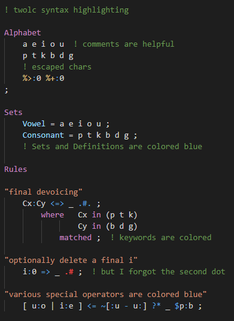

# twolc-lang README

Provides syntax highlighting for the `twolc` two-level rule compiler language, used by xfst, HFST, and Foma to augment finite-state transducers.

## Features

<!-- TODO: Describe specific features of your extension including screenshots of your extension in action. Image paths are relative to this README file. -->

## Known Issues

<!-- Calling out known issues can help limit users opening duplicate issues against your extension. -->

Only declarations of Definitions and Sets are highlighed, not references after declaration.

## Release Notes

Users appreciate release notes as you update your extension.

### 0.1.2

Initial release
